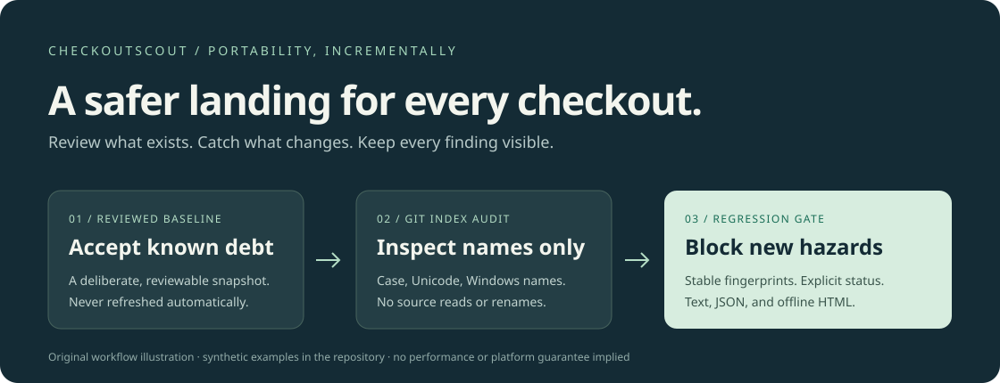

# CheckoutScout

**Catch new checkout hazards. Keep existing portability debt visible.**

[](https://github.com/Tabisharaza/checkoutscout/actions/workflows/ci.yml)
[](LICENSE)

A zero-dependency Node.js CLI for teams whose Git repositories need to work on
more than one kind of machine. Find case and Unicode collisions, Windows-invalid
names, and suspicious path components. Adopt it incrementally with a reviewed
baseline, then fail CI only when **new** hazards appear.

No account, server, source-file upload, or network request. The generated HTML
report is a self-contained file with no JavaScript, remote assets, or telemetry.

[Quick start](#quick-start) · [Baseline workflow](#adopt-without-a-cleanup-big-bang) ·
[Sample report](examples/report.html) · [Rule catalog](docs/rules.md) ·
[Contribute](CONTRIBUTING.md)



## The problem

A Linux checkout can contain `src/Button.tsx` and `src/button.tsx`. A contributor
on a case-insensitive volume may see a collision instead. Two folders spelled
`Docs` and `docs` also matter even when their children have different names.
Windows adds reserved device names, forbidden characters, and trailing-dot rules.
[Microsoft documents these cross-platform Git hazards](https://learn.microsoft.com/en-us/azure/devops/repos/git/os-compatibility?view=azure-devops).

An established repository may already have debt. Turning on a strict checker
without a migration path can block unrelated work. CheckoutScout makes that
tradeoff explicit: accept a reviewed snapshot, retain the findings in every
report, and reject newly introduced problems. It does not silently fix names.

## Quick start

Requirements: **Node.js 22 or newer**, plus **Git** for index scans. The reference
build uses Node.js **24.19.0** (`.nvmrc`). No npm install is needed to run the CLI.
This repository is the distribution; an npm registry release is not claimed.

```sh
git clone https://github.com/Tabisharaza/checkoutscout.git
cd checkoutscout
node bin/checkoutscout.js --help
node bin/checkoutscout.js --repo /path/to/your/repo
```

Paths containing spaces should be quoted. On Windows, use a path such as
`--repo "C:\work\my-repo"`. Passing a repository subdirectory still audits its
complete index. Only tracked/staged paths are included; untracked files and the
contents of tracked files are never scanned. Submodule entry names are included,
not their nested repositories. Symlink names are included, not their targets.

Try the included synthetic case without Git:

```sh
node bin/checkoutscout.js --paths examples/paths.json --baseline examples/baseline.json
```

This example deliberately exits **1**: it has new hazards to show.

```text
CheckoutScout · portability review
11 paths · 4 new · 1 accepted · 1 resolved/changed

NEW ERROR case-collision
  "docs": Distinct file or directory spellings match after ASCII A–Z are lowercased.
    "Docs/getting-started.md"
    "docs/api.md"
```

The complete, generated terminal output is [examples/report.txt](examples/report.txt).
The excerpt above is abbreviated; messages and totals are verified against that file.

## Adopt without a cleanup big bang

1. Audit the repository and inspect the findings.
2. If the existing risks are acceptable for now, explicitly create a baseline:

   ```sh
   node bin/checkoutscout.js --repo ../your-repo --save-baseline path-baseline.json
   ```

3. Review the baseline's filenames before committing it with the project. A
   baseline records acceptance, **not safety**.
4. Compare future work against it:

   ```sh
   node bin/checkoutscout.js --repo ../your-repo --baseline path-baseline.json
   ```

A collision group's exact path membership is fingerprinted. Adding a new member
or changing a group's identity creates a new finding; an old acceptance cannot
silently bless the change. Reordering input does not change fingerprints.

“Resolved / changed” means a baseline fingerprint no longer exists. It can mean
an actual fix **or** a collision group that changed and reappeared as a new
finding. Both states are visible so a smaller count cannot hide a regression.

Baselines are never updated automatically. To refresh one, generate a separately
named baseline, review its diff, then replace it yourself. Both report and baseline
file creation refuse to overwrite existing files, including symlinks. Do not
regenerate baselines automatically in CI; that would accept the very regressions
you want to catch. Treat baseline changes like code-review decisions.

## Reports

```sh
# Machine-readable, deterministic JSON to stdout
node bin/checkoutscout.js --repo ../your-repo --format json

# A shareable, offline report; file is still created if findings cause exit 1
node bin/checkoutscout.js --repo ../your-repo --baseline path-baseline.json --format html --output portability.html

# Make new warnings block CI too
node bin/checkoutscout.js --repo ../your-repo --baseline path-baseline.json --strict
```

HTML reports provide expandable affected-path lists, new/accepted status, and
remediation guidance. They escape markup and make terminal/bidirectional controls
visible. The committed [sample HTML](examples/report.html) can be downloaded and
opened locally; GitHub's source viewer does not render it as a web page.

Reports and baselines contain **filenames**, which can themselves be sensitive.
They omit source contents, absolute checkout paths, timestamps, and machine IDs.
Review before sharing. There is no automatic report upload.

### Options and exit codes

Run `--help` for the complete option list. `--repo` and `--paths` are mutually
exclusive; so are `--baseline` and `--save-baseline`. `--paths` accepts a UTF-8
JSON array of repository-relative slash-separated paths, useful for tests or
names the host cannot materialize. Duplicate identical paths are deduplicated.

| Exit | Meaning |
| --- | --- |
| `0` | No new errors (or no new warnings in strict mode), or a baseline was explicitly saved |
| `1` | New blocking findings; requested report was produced |
| `2` | Invalid options, malformed input, Git failure, or report/baseline I/O failure |

A `--save-baseline` run intentionally returns `0` when the baseline is created,
even if it contains errors. Never use that option for your CI gate.

## Add a CI gate

Keep a reviewed copy of CheckoutScout in your tooling directory or use a checkout
of this repository pinned to a commit you reviewed. No registry token is needed.
A basic step in a workflow that already checked out the target repository:

```yaml
- name: Check new path hazards
  run: node tools/checkoutscout/bin/checkoutscout.js --repo . --baseline path-baseline.json --strict
```

This snippet assumes you placed the tool at `tools/checkoutscout`; it is not a
published GitHub Action. Standard GitHub-hosted Linux is a useful place to catch
names that a Windows/macOS checkout might already have trouble representing.
The tool's own [CI](.github/workflows/ci.yml) tests Linux, Windows, and macOS.

## What it checks

- ASCII case and NFC-normalization collisions, including directory prefixes
- File/directory aliases under those transformations
- Heuristic non-ASCII lowercase collisions, reported as warnings
- Windows forbidden characters, reserved names (including device names with
  extensions and superscript digits), and trailing dots/spaces
- Component length above a conservative 255-byte / 255-UTF-16-unit budget
- Selected invisible and bidirectional formatting characters

Read the [rule catalog](docs/rules.md) for exact scope, severity, and limitations.
Errors mean likely incompatibility within this model; warnings call for review.

### Limits and non-goals

This is a focused portability model, **not an exact filesystem emulator or a
security scanner**. A clean report is not proof that every checkout will work.

- It does not fully emulate NTFS/APFS/HFS+ case tables, 8.3 aliases, Unicode
  confusables, mount options, access permissions, symlink behavior, or Git's
  platform-specific protection rules.
- NFC and JavaScript lowercase behavior use the installed Node runtime's Unicode
  tables. Keep the Node version consistent when comparing baselines across CI.
- Component budgets are warnings. Full absolute path length depends on checkout
  location and application settings; it is not checked.
- Scans inspect the complete current index, not a commit, remote branch, staged
  diff, untracked files, working-tree contents, or submodule contents.
- Git names must be valid UTF-8. Invalid byte sequences fail the entire run with
  exit `2`; they are not replaced or quietly ignored. JSON input must contain
  well-formed Unicode and canonical relative syntax (no empty, `.` or `..`
  components).
- Input is limited to 32 MiB and 100,000 entries. Each path allows up to 32,768
  UTF-16 units and 256 components; unique paths together allow 250,000 components
  and 32 MiB of UTF-8 names. The audit stops with exit `2` before producing any
  partial report if it exceeds 10,000 findings or 8 MiB of serialized issue data.
  Git execution times out after 30 seconds. These are resource limits, not speed claims.
- No automatic fixes, suppression globs, SARIF export, package-registry release,
  or hosted dashboard in v0.1.0.

## Why another tool?

Use [pre-commit-hooks](https://github.com/pre-commit/pre-commit-hooks) if you already
use pre-commit and want focused filename hooks. [git-path-audit](https://github.com/bunta-expert/git-path-audit)
offers a broader Git-native audit with multiple sources, raw-byte handling, and
SARIF. [pathvalidate](https://github.com/thombashi/pathvalidate) validates and
sanitizes paths in Python applications.

CheckoutScout is an independent, intentionally small option for Node-based teams
who want a **reviewed baseline ratchet and an offline visual report** without a
dependency installation. Similar rules exist elsewhere; the project does not
claim to invent filename portability checks.

## Development and reproducibility

```sh
npm ci --ignore-scripts --no-audit --no-fund
npm run verify
npm run demo
node dist/bin/checkoutscout.js --help
```

- `npm run check`: JavaScript syntax and zero-dependency lockfile checks
- `npm test`: deterministic engine, baseline, escaping, CLI, and real Git-index tests
- `npm run build`: a fresh `dist/` runtime bundle plus `SHA256SUMS`; no transpiler
- `npm run demo`: regenerates committed reports from synthetic path strings

The lockfile has zero third-party packages. Build outputs contain no timestamps;
CI rebuilds twice and compares the checksum manifest. CI also verifies that
regenerating examples leaves them unchanged. The README illustration explains the workflow; the committed text, JSON, and
HTML examples are actual generated output from the synthetic fixture.

## Contributing

Small, concrete contributions are welcome: improve a documented edge case with a
synthetic regression test, add report accessibility coverage, or help design a
baseline review command. Start with [CONTRIBUTING.md](CONTRIBUTING.md) and the
[open issues](https://github.com/Tabisharaza/checkoutscout/issues). No traction,
performance, or cross-filesystem guarantee is implied by this initial release.

[MIT License](LICENSE) · [Third-party notices and references](THIRD_PARTY.md) ·
[Security boundaries](SECURITY.md)
